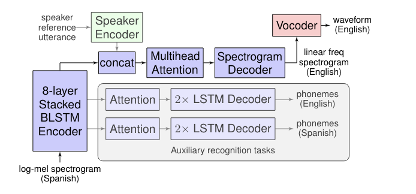

# Translatotron: Direct Speech-to-Speech Translation

This project implements the Translatotron model, a sequence-to-sequence approach for direct speech-to-speech translation without relying on intermediate text representations. The implementation is based on the paper "Direct speech-to-speech translation with a sequence-to-sequence model" by Ye Jia et al.


<p align="center">
  
</p>
 
## Introduction

Translatotron is an end-to-end model that directly translates speech from one language to another without intermediate text representations. This implementation provides a PyTorch version of the model along with utilities for training and audio playback.

## Features

- Direct speech-to-speech translation
- Encoder-decoder architecture with attention
- Auxiliary decoders for multi-task learning
- Griffin-Lim algorithm for waveform reconstruction
- Utility functions for audio playback and saving

## Requirements

- Python 3.7+
- PyTorch 1.7+
- torchaudio
- numpy
- soundfile
- IPython (for notebook environments)

## Installation

1. Clone this repository:
   ```python
   git clone https://github.com/abdouaziz/translatotron.git
   cd translatotron
   ```

2. Install the required packages:
   ```python
   pip install -r requirements.txt
   ```

## Usage

Here's a basic example of how to use the Translatotron model:

```python
from translatotron import Translatotron, play_audio
import torch

# Initialize the model
model = Translatotron()

# Create a dummy input (replace with your actual input)
dummy_input = torch.randn(1, 100, 80)  # (batch_size, sequence_length, input_features)

# Forward pass
waveform, aux_source, aux_target = model(dummy_input)

# Play or save the generated audio
play_audio(waveform[0], filename="output.wav")

```

## Model Architecture

The Translatotron model consists of:

1. Encoder: Bidirectional LSTM
2. Decoder: LSTM
3. Auxiliary Decoder: For multi-task learning
4. Spectrogram Generator: Linear projection
5. Waveform Generator: Griffin-Lim algorithm

For detailed architecture, refer to the original paper : [Direct speech-to-speech translation with a sequence-to-sequence model](https://arxiv.org/abs/1904.06037).

## Training

To train the model:

1. Prepare your dataset of paired speech in source and target languages.
2. Implement a custom `Dataset` class for your data.
3. Define loss functions for waveform reconstruction and auxiliary tasks.
4. Set up a training loop with appropriate optimizers.

Example training loop (pseudo-code):

```python
# ... (setup model, optimizer, data loader)

for epoch in range(num_epochs):
    for batch in data_loader:
        optimizer.zero_grad()
        waveform, aux_source, aux_target = model(batch['input'])
        loss = compute_loss(waveform, aux_source, aux_target, batch['target'])
        loss.backward()
        optimizer.step()
    
    # Validation and checkpointing
```

## Evaluation

Evaluate the model using:

1. Speech recognition on the translated output
2. Human evaluation of translation quality

## Audio Playback

The `play_audio` function provides a convenient way to play or save generated audio:

```python
play_audio(waveform, sample_rate=24000, filename="output.wav")
```

This function works in Jupyter notebooks, Google Colab, and standard Python scripts.

## Contributing

Contributions are welcome! Please feel free to submit a Pull Request.